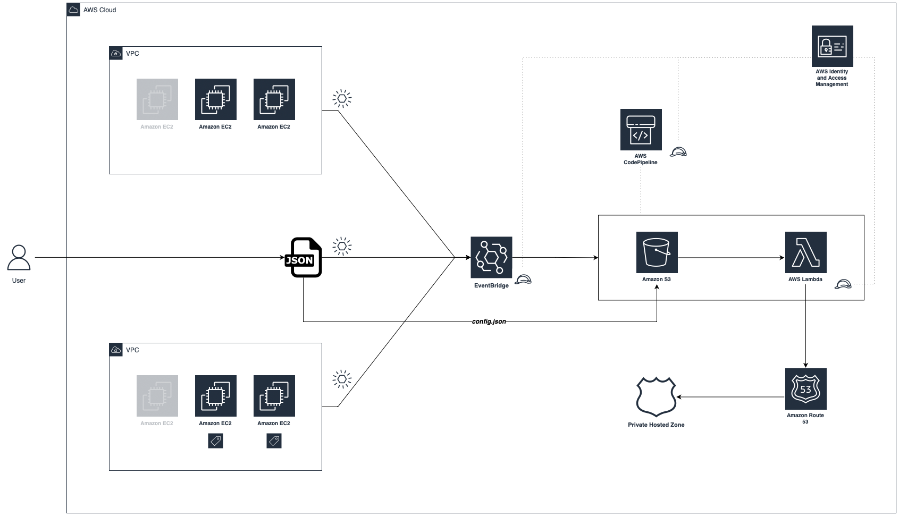
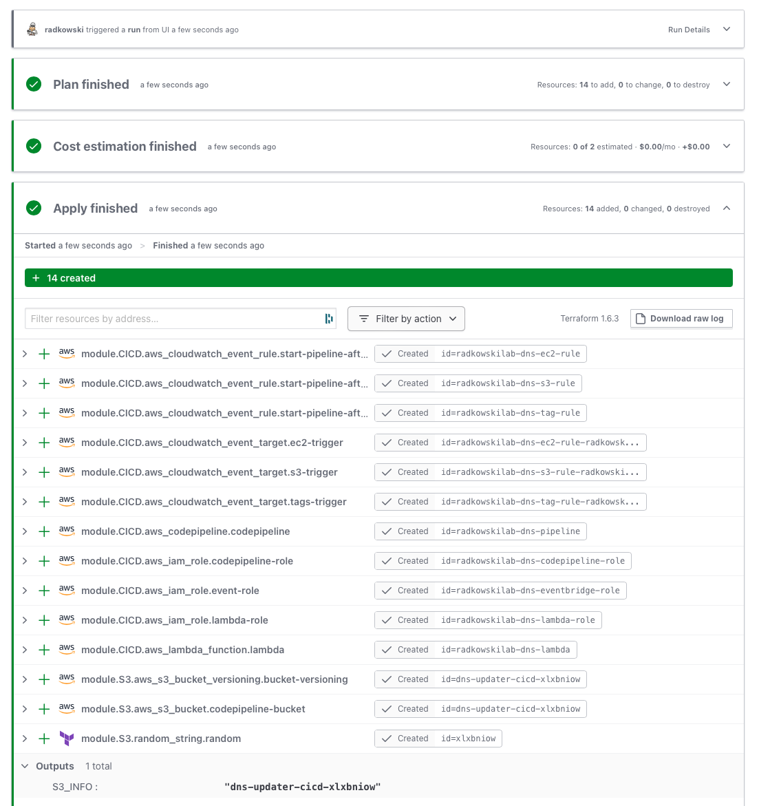
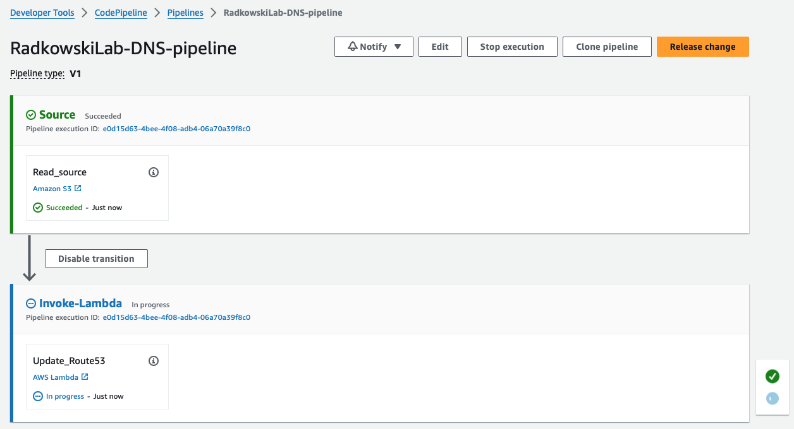
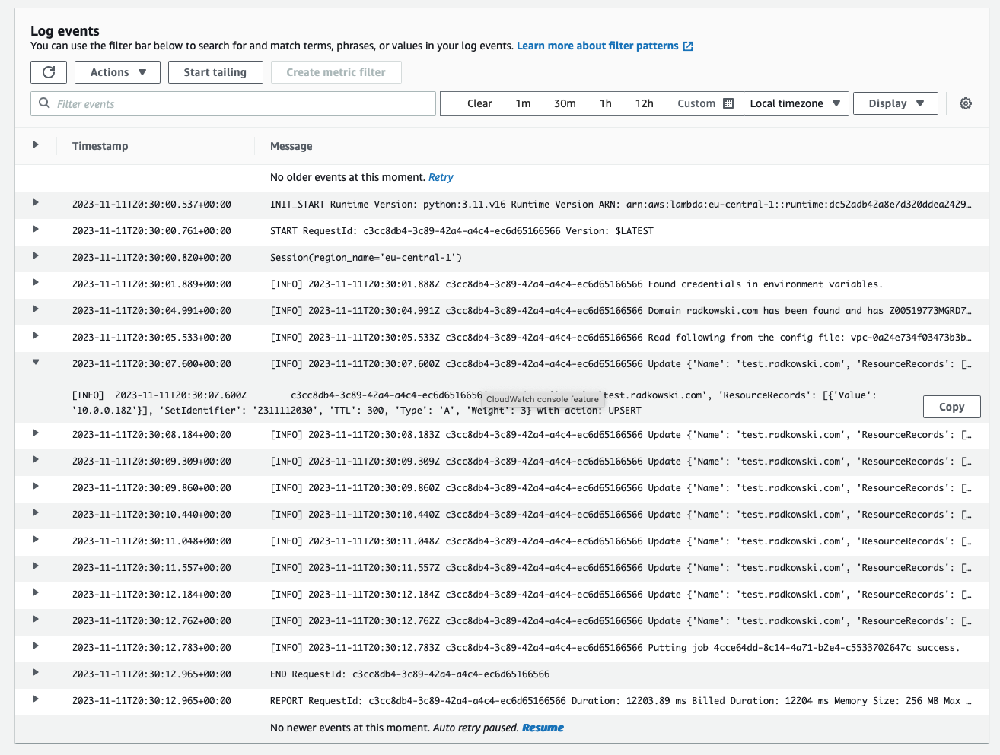
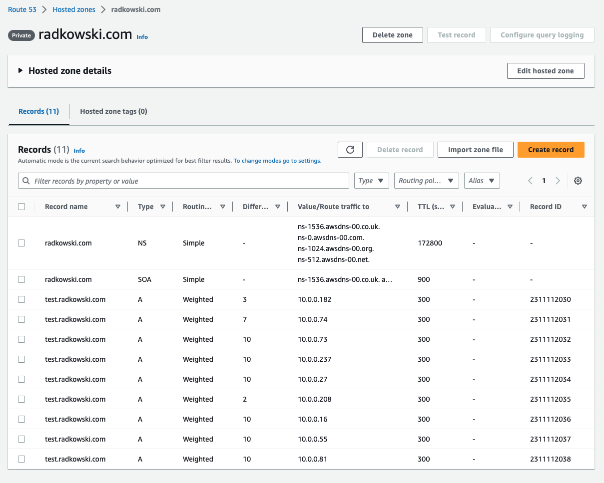

# DNS Updater

Following solution deploys lab to configure CICD pipeline that updates Route53 Private hosted Zone

## Solution Diagram




## Description

Following solution deploys CICD pipeline that updates Route53 PHZ by adding A type weighted records. Solution is build based on following services:

- [ ] CodePipeline: AWS CICD orchestrator
- [ ] S3: object storage for [config file](#configfile) and artifacts
- [ ] Lambda: Validates environment and execute changes
- [ ] EventBridge: triggers CICD pipeline based on following events:
    - config file upload
    - EC2 instance(s) state change
    - EC2 instance tag(s) change
- [ ] Route53: AWS DNS implementation. Stores Private Hosted Zone that is updated by lambda function

## Tagging policy
- [ ] Only EC2 tagged using __DNSRecord__ key will be selected by solution to update Route53. This tag is ___mandatory___.


[Config file](#configfile) parameters:
```json
(...)
  "Route53": {
      "HostName": "test",
      "DomainName": "radkowski.com",
    (...)
  }
```
Tags:
```code
DNSRecord: test.radkowski.com
```
- [ ] It's possible to add  __DNSRecordWeight__ tag that describes weight parameter configured in Route53. This tag is ___optional___ and if not set, solution will use default value [DefaultWeight](#configfileparameters) from [config file](#configfile):
```json
(...)
  "Route53": {
      "DefaultWeight": 10
    (...)
  }
```
Tags:
```code
DNSRecordWeight: 23
```

## Workflow

Solution works based of following steps:

- [ ] CICD is trigerred using one of three event's type
- [ ] config file is read from S3 bucket and passed to lambda as artifact
- [ ] lambda reads config file and validates environment
- [ ] if validation is completed, lambda updates Route53 private Hosted Zone


## Validation

### Domain validation

Before DNS updates, solution reads domain name from [config file](#configfile) and provides following checks:
- [ ] if Route 53 hosted zone defined in config file exists  
- [ ] if hosted zone has type: Private
- [ ] if hosted zone is assigned with VPC listed in config file

Domain must match all three criteria be be used by solution


### EC2 validation

Only IP of EC2 instances that meet following criteria will be used to update Route53 Private Hosted Zone:
- [ ] EC2 instance musy have __DNSRecord__ tag set
- [ ] __DNSRecord__ tag value must match hostname.domainname from [config file](#configfile)
- [ ] EC2 must be deployed inside VPC defined in [config file](#configfile)

EC2 instance must match all three criteria be be used by solution

<a name="configfile"></a> 
## Config file

Config file should be uploaded into S3 bucket created as a part of solution and must have __config.json__ name.

```json
{
  "Network": {
      "Vpc_id": "vpc-0a24e734f03473b3b"
  },
  "Route53": {
      "HostName": "test",
      "DomainName": "radkowski.com",
      "DefaultWeight": 10,
      "DefaultTTL": 300
  },
  "Settings": {
      "WipeBeforeAdd": "True"
  }
}

```


<a name="configfileparameters"></a> 
### Config file parameters
 -  **_Vpc_id_**: VPC that is used to deploy EC2 instance and is associated with Private Hosted Zone
 -  **_HostName_**: name of A record to be created in PHZ
 -  **_DomainName_**: name of domain/private hosted zone to be updated by solution
 -  **_DefaultWeight_**: default value for __weight__ parameter in Route53, when EC2 doesn't have __DNSRecordWeight__ tag
 -  **_DefaultTTL_**: TTL value for configured A records
 -  **_WipeBeforeAdd_**: Boolean that controls update behaviour

## Update behaviour

Solution can update Route53 Private Hosted Zone in two ways

- [ ] **_WipeBeforeAdd_** set to __True__: All A weighted-type _hostname.domainname_ records from Private Hosted Zone will be removed before adding new.
- [ ] **_WipeBeforeAdd_** set to __False__: Solution will not delete any existing record only add/update new.


### EC2 validation

- [ ] only role attached to EC2 **(RA)** as an Instance profile, can interact with S3.
- [ ] RA can only Get objects.
- [ ] RA interact with S3 using internal access point alias.

## Screenshots

### Terraform Deployment


### AWS CodePipeline


### Amazon CloudWatch


### Amazon Route53
